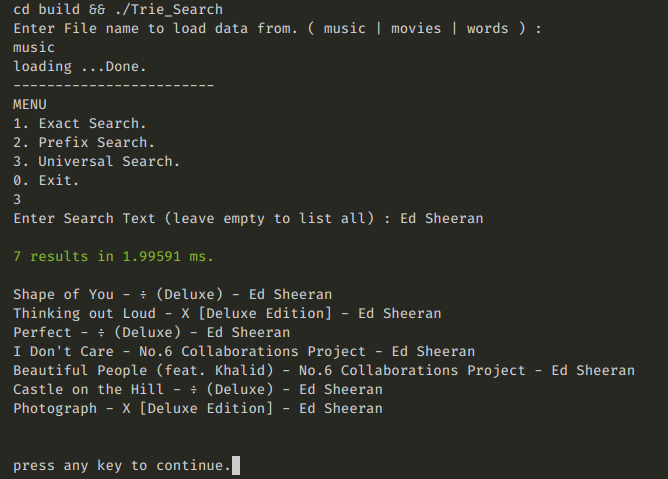
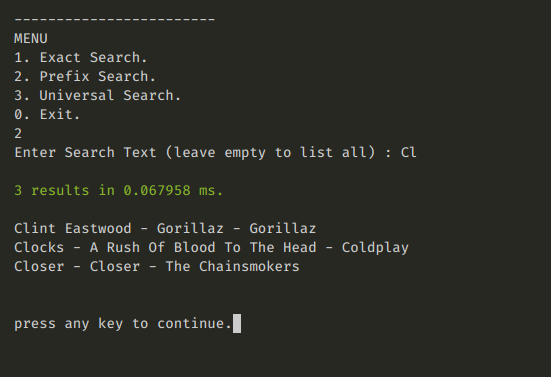

# Trie Search
A little search engine implementation using the trie data structure.

### Build & run
- `make` — compile and run (executable lands in `build/trie-search`)
- `make cmp` — compile only
- `make run` — run the existing build
- `make clean` — remove `build/`

Run from the **repo root**; datasets are found automatically in `data/`.

### Manual (trie-search)
- `./build/trie-search` — prompts for a dataset
- `./build/trie-search music` — load `data/music.txt`
- `./build/trie-search [path_to_file]`
- `./build/trie-search [path_to_file] [pattern_to_search]` — one-shot substring search, prints matches and exits

### Menu
| # | Mode | Backed by |
|---|---|---|
| 1 | Exact search | trie walk, O(m) |
| 2 | Prefix search | trie walk + DFS |
| 3 | Universal search | KMP substring scan |
| 4 | Delete a word | trie walk + node pruning |
| 5 | Stats | node / word counters |
| 6 | Benchmark | trie prefix vs linear scan, side by side |

Leaving the search text empty lists everything.

---

#  Trie
In computer science, a trie, also called digital tree or prefix tree, is a kind of search tree—an ordered tree data structure used to store a dynamic set or associative array where the keys are usually strings.

Unlike a binary search tree, no node in the tree stores the key associated with that node; instead, its position in the tree defines the key with which it is associated; i.e., the value of the key is distributed across the structure. All the descendants of a node have a common prefix of the string associated with that node, and the root is associated with the empty string. Keys tend to be associated with leaves, though some inner nodes may correspond to keys of interest. Hence, keys are not necessarily associated with every node. For the space-optimized presentation of prefix tree, see compact prefix tree.

# Applications

- Looking up data in a trie is faster in the worst case, O(m) time (where m is the length of a search string), compared to an imperfect hash table. An imperfect hash table can have key collisions. A key collision is the hash function mapping of different keys to the same position in a hash table. The worst-case lookup speed in an imperfect hash table is O(N) time, but far more typically is O(1), with O(m) time spent evaluating the hash.
- There are no collisions of different keys in a trie.
- There is no need to provide a hash function or to change hash functions as more keys are added to a trie.
- A trie can provide an alphabetical ordering of the entries by key.

**Complexities**
> Insert : O(m)    : m is the length of string.  
> Delete : O(m)    : m is the length of string.  
> Search : O(m)    : m is the length of string.  
>
> Space Complexity : O(n*m)     :  n = number of string , m = avg length of strings

# Example
### Universal Search

### Prefix Search 

# Benchmark notes
Option 6 runs the same prefix query through the trie and through a naive linear
scan and prints both timings, so the win is measurable rather than asserted.
Measured on this machine:

| Dataset | Entries | Trie | Linear scan |
|---|---|---|---|
| `data/music.txt` | 994 | 0.081 ms | 0.008 ms |
| random words | 200,000 | 0.008 ms | 1.011 ms |

At ~1k entries the linear scan actually wins — the trie's DFS and string
concatenation cost more than just scanning the list. The trie pulls ahead by
roughly two orders of magnitude once the dataset is large, which is the point
worth making.

# Fixed in this revision
- **Crash:** universal search on an empty pattern segfaulted. `KMPSearch`
  declared `int lps[M]` with `M == 0` and then wrote `lps[0]`. Now an empty
  pattern short-circuits to a match at index 0, and `lps` is a `std::vector`
  instead of a zero-length VLA.
- **Hang:** any non-numeric input or a piped EOF sent the menu into an infinite
  loop, because `cin >> choice` never cleared its fail state. Input is now read
  line-wise and validated, and EOF exits cleanly.
- **Wrong result:** `linear_search_exact` returned `false` even on a match.
- **Out-of-bounds read:** `linear_search_pre` indexed `s[i]` without checking
  `s.size()`, so any prefix longer than an entry read past the end.
- **Trie corruption:** `remove` used `children[ch]`, which *inserts* a null child
  on a miss. It now uses `find`, frees pruned nodes, and reports whether the word
  was actually there.
- **Memory:** nodes were never freed; `Trie` now has a destructor (copying is
  deleted, since nodes are raw-owned).
- **File reading:** `while (!file.eof())` read one phantom line past the end;
  now `while (getline(...))`, and trailing `\r` from CRLF files is stripped.
- **Structure:** `#include "trie.cpp"` replaced with real headers
  (`trie.h`, `utils.h`, `timing.h`) and separate translation units.
  `<bits/stdc++.h>` (GCC-only) replaced with the standard headers actually used.
- **Portability:** `system("clear")` replaced with an ANSI escape, emitted only
  when stdin is a terminal.
- **Hygiene:** removed the committed `src/main` binary, its `.dSYM` bundle, and
  `.DS_Store`; added `.gitignore`. The Makefile no longer claims to be
  CMake-generated and builds all three sources with `-Wall -Wextra` (clean).
- Delete and the linear-scan baselines were implemented but unreachable from the
  menu; both are now wired up (options 4 and 6).

Builds clean with `-Wall -Wextra`, and runs clean under
`-fsanitize=address,undefined` including the previously crashing inputs.
